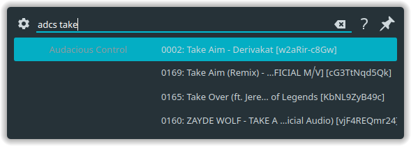

# KDE Audacious control runner



This is simple(currently) that allows you to use krunner to switch between tracks. Type adcs and then start typing track name, select track and press enter track should now be selected.

## Features
* Switch to different tracks

Planned:
* Queue tracks instead of jump
* Change volume
* View and remove elemnts of queue

Suggest more ideas in project issues tab.

## Build & Install
```bash
git clone https://github.com/max8rr8/krunner-audacious.git
cd krunner-audacious
mkdir build && cd build
cmake ..
make
sudo make install
```

